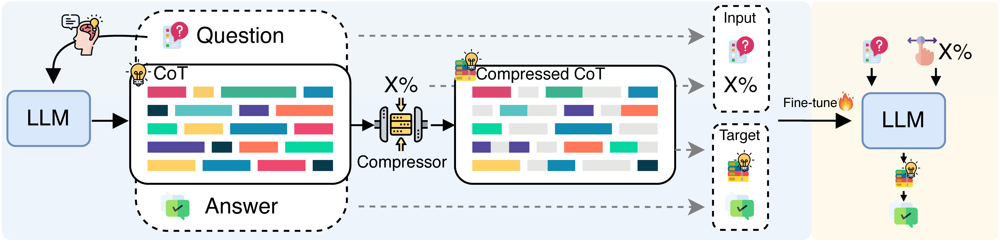
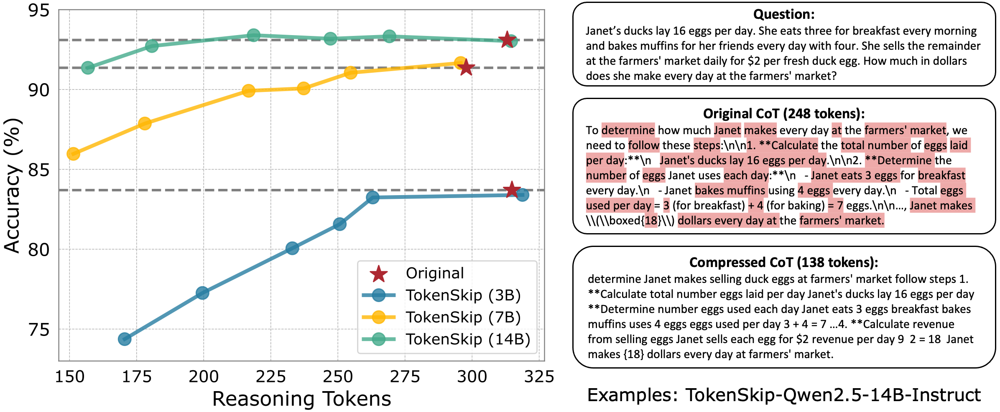

<div align="center">
<h1> TokenSkip: Controllable Chain-of-Thought Compression in LLMs</h1> 
</div>

<p align="center">
<a href="https://arxiv.org/abs/2502.12067">
  </a> 
<a href="https://opensource.org/licenses/Apache-2.0">
  </a> 
<a href="https://github.com/hemingkx/TokenSkip/pulls">
    </a>
</p>

## Introduction

*Does every token in the CoT output contribute equally to deriving the answer?* —— We say **NO**!

We introduce ***TokenSkip***, a simple yet effective approach that enables LLMs to selectively skip redundant tokens during Chain-of-Thought generation and learn shortcuts between critical reasoning tokens, thereby allowing for controllable CoT compression with adjustable ratios.

TokenSkip constructs compressed CoT training data with various compression ratios, by pruning unimportant tokens from original CoT trajectories. Then, it conducts a general supervised fine-tuning process on target LLMs with this training data, enabling LLMs to automatically trim redundant tokens during reasoning.



**This method is distinguished by its low training cost.** For Qwen2.5-14B-Instruct, TokenSkip fine-tunes only **0.2%** of the model's parameters using LoRA. The size of the compressed CoT training data is no larger than that of the original training set, with 7,473 examples in GSM8K and 7,500 in MATH. The training is completed in approximately **2.5 hours** for the 14B model on two 3090 GPUs. These characteristics make TokenSkip an *efficient* and *reproducible* approach, suitable for use in efficient and cost-effective LLM deployment.

We observe that as the model scale increases, there is less performance degradation at higher compression ratios, indicating that larger LLMs are better at identifying shortcuts between critical reasoning tokens, enabling more efficient CoT generation. Notably, Qwen2.5-14B-Instruct exhibits almost **NO** performance drop (less than 0.4%) with **40%** token trimming. Even at a compression ratio of 0.5, the model maintains strong reasoning capabilities, with only 2% performance degradation. 



## Update

**2025.2.22**: We have released the code for CoT compression and the instructions for SFT🔥!

**2025.2.17**: We have released the evaluation scripts and checkpoints for TokenSkip. Check it out!

## Todo

- [x] Release checkpoints for Qwen2.5-Instruct series
- [x] Release evaluation code on GSM8K and MATH-500
- [x] Release code for compressed CoT data construction
- [x] Add instructions for SFT (LoRA) on LLaMA-Factory
- [ ] Investigations on TokenSkip with larger model scales

## Model Weights

Download corresponding model weights and modify the checkpoint path in `eval.sh`.

| LoRA Adapter                         | Link                                                         |
| ------------------------------------ | ------------------------------------------------------------ |
| TokenSkip-Qwen2.5-3B-Instruct-GSM8K  | [huggingface](https://huggingface.co/hemingkx/TokenSkip-Qwen2.5-3B-Instruct-GSM8K) |
| TokenSkip-Qwen2.5-7B-Instruct-GSM8K  | [huggingface](https://huggingface.co/hemingkx/TokenSkip-Qwen2.5-7B-Instruct-GSM8K) |
| TokenSkip-Qwen2.5-14B-Instruct-GSM8K | [huggingface](https://huggingface.co/hemingkx/TokenSkip-Qwen2.5-14B-Instruct-GSM8K) |

## Installation

```
conda create -n tokenskip python=3.12
conda activate tokenskip
cd TokenSkip
pip install -r requirements.txt
```

## Token Pruning

**1.Obtain the original CoT outputs of the training data, using the target LLM**

Modify the command lines in `eval.sh` (e.g., set `DATA_TYPE` to `train`) and run `evaluation`.

```
python ./evaluation.py --output-dir "outputs/Qwen2.5-7B-Instruct/gsm8k/" \
    --model-path "/your_model_path/Qwen2.5-7B-Instruct" --tokenizer-path ${MODEL_PATH} \
    --model-size "7b" --model-type "qwen" --data-type "train"  \
    --max_num_examples 100000000000000 --max_new_tokens 512 \
    --eval_batch_size 32 --temperature 0.0 --seed 42 --benchmark "gsm8k"
```

> The original CoT outputs of the target LLM will be stored in `outputs/.../Original`.

**2.Prune original CoTs using LLMLingua**

Download the [model weights](https://huggingface.co/microsoft/llmlingua-2-xlm-roberta-large-meetingbank) for [LLMLingua-2](https://github.com/microsoft/LLMLingua) and modify the checkpoint path in `LLMLingua.py`.

Run `LLMLingua` to obtain compressed CoTs with various compression ratios.

```
python ./LLMLingua.py
```

> The compressed CoTs will be stored in `outputs/.../Compression`.

**3.Convert training data to LLaMA-Factory format**

Run `get_llamafactory_input` to convert the training data into the format of [LLaMA-Factory](https://github.com/hiyouga/LLaMA-Factory).

```
python ./get_llamafactory_input.py
```

> The converted data will be stored in `outputs/mydataset.json`.
>
> For reference, we provide our processed training data in `datasets/gsm8k/llamafactory_inputs/`.

## Training

TokenSkip follows the general LoRA SFT pipeline of [LLaMA-Factory](https://github.com/hiyouga/LLaMA-Factory). Here's how to set it up:

1. Git clone [LLaMA-Factory](https://github.com/hiyouga/LLaMA-Factory) and install the required environments.
2. Place the training data under `LLaMA-Factory/data/` and register it in `data/dataset_info.json`.
3. To fine-tune the target LLM with LoRA, run the following command:

```
CUDA_VISIBLE_DEVICES=0 llamafactory-cli train examples/train_lora/myllama3_lora_sft_compressed_gsm8k_llmlingua2_qwen.yaml
```

> We provide our training configs in `configs/examples/train_lora` for your reference.

## Inference

Modify and run command lines in `eval.sh`, the results will be stored in `outputs/`.

```
python ./evaluation.py --output-dir "outputs/Qwen2.5-7B-Instruct/gsm8k/" \
    --model-path "/your_model_path/Qwen2.5-7B-Instruct" --tokenizer-path ${MODEL_PATH} \
    --model-size "7b" --model-type "qwen" --data-type "test"  \
    --max_num_examples 100000000000000 --max_new_tokens 512 \
    --eval_batch_size 32 --temperature 0.0 --seed 42 --benchmark "gsm8k" \
    --adapter-path "/your_model_path/TokenSkip-Qwen2.5-7B-Instruct-GSM8K" \
    --compression_ratio 0.5 --use_adapter
```

## Q&A

Frequently asked questions about the re-implementation of TokenSkip can be found in [Q&A](./assets/Q&A.md).

## Contributing

We warmly welcome contributions and discussions related to TokenSkip! If you have any suggestions for improvements or ideas you'd like to discuss, please don't hesitate to open an issue. This will allow us to collaborate and discuss your ideas in detail.

## Acknowledgments

This codebase is built from [DeepSeek-Math](https://github.com/deepseek-ai/DeepSeek-Math) and [LLMLingua](https://github.com/microsoft/LLMLingua).

## Citation

If you find the resources in this repository useful, please cite our paper:

```
@misc{xia2025tokenskip,
      title={TokenSkip: Controllable Chain-of-Thought Compression in LLMs}, 
      author={Heming Xia and Yongqi Li and Chak Tou Leong and Wenjie Wang and Wenjie Li},
      year={2025},
      eprint={2502.12067},
      archivePrefix={arXiv},
      primaryClass={cs.CL},
      url={https://arxiv.org/abs/2502.12067}, 
}
```

